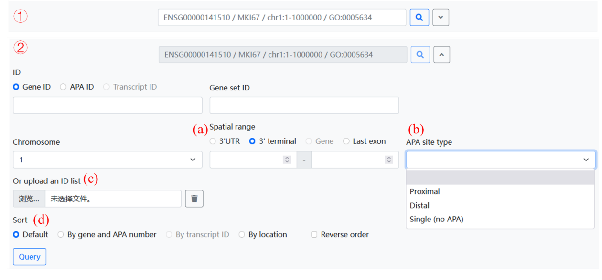
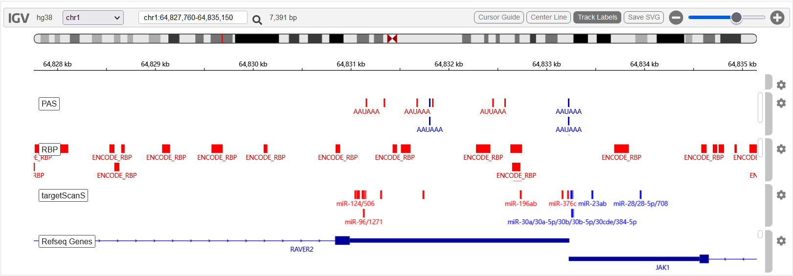
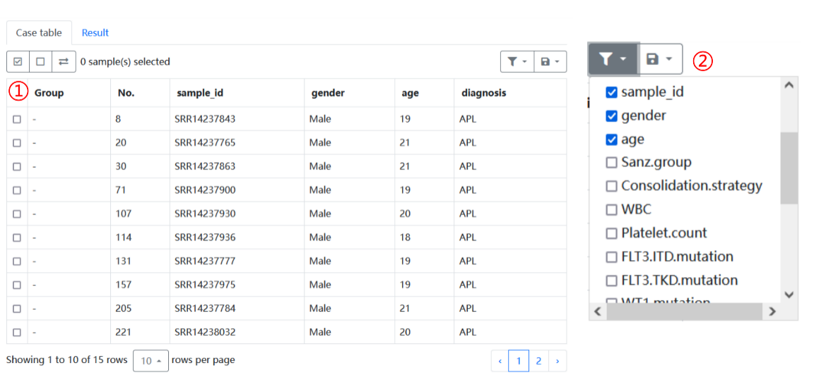
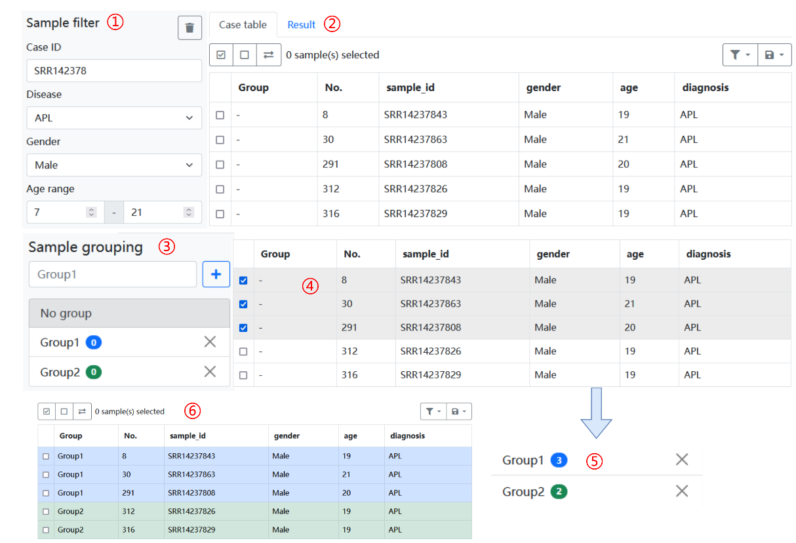
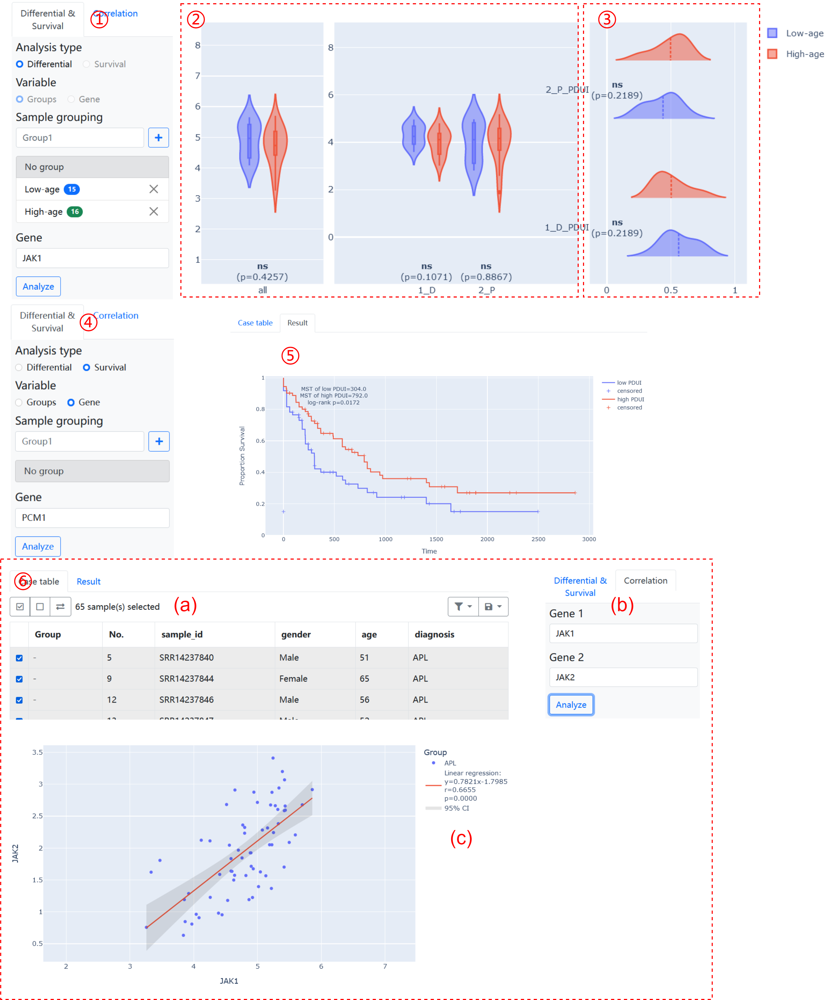

# APAview

** current version **: 0.1.1 

## Introduction

**APAview** is a web-based platform for **alternative polyadenylation** (APA) features exploration on APA quantification data from QAPA/DaPars in hematological tumors. Taking APA, gene/transcript expression, and clinical data as input, APAview could:

**(1)** provide correlation analysis between APA usage index and gene/transcript expression;

**(2)** provide differential analysis of APA usage index or other features among groups; 

**(3)** identify genes with shortened/lengthened 3’UTR between groups; 

**(4)** provide survival analysis based on APA usage index;

**(5)** annotate genes and APA sites using databases such as NCBI and polyA DB;

**(6)**  visualize gene structures, APA sites, miRNA, RBP, and APA motifs in IGV plots.

## Installation and Usage

1. Install Python 3.9 on Windows/Linux.

2. Create  an environment for APAview running.

   Windows:

   ```
   python -m venv APAview_env
   .\APAview_env\Scripts\Activate.ps1 (using python)
   .\APAview_env\Scripts\activate.bat (using cmd)
   ```

   Linux:

   ```
   python3 -m venv APAview_env
   . ./APAview_env/bin/activate
   ```

3. Install dependency packages.

   Windows:

   ```
   python -m pip install --upgrade setuptools pip
   python -m pip install wheel
   python -m pip install flask statsmodels xarray h5netcdf plotly
   #########################
   Package         Version
   --------------- --------
   Flask           2.0.3
   h5netcdf        0.14.1
   pandas          1.4.1
   plotly          5.6.0
   statsmodels     0.13.2
   xarray          2022.3.0
   ##########################
   ```

   Linux:

   ```
   python3 -m pip install --upgrade setuptools pip
   python3 -m pip install wheel
   python3 -m pip install flask statsmodels xarray h5netcdf plotly
   #########################
   Package         Version
   --------------- --------
   Flask           2.0.3
   h5netcdf        0.14.1
   pandas          1.4.1
   plotly          5.6.0
   statsmodels     0.13.2
   xarray          2022.3.0
   ##########################
   ```

4. Download the latest development version of APAview and unzip the file to `/pathway/APAview`.

5. Run APAview in `APAview_env`.

   ```
   cd /pathway/APAview
   flask run
   #################
    * Environment: production
      WARNING: This is a development server. Do not use it in a production deployment.
      Use a production WSGI server instead.
    * Debug mode: off
    * Running on http://127.0.0.1:5000/ (Press CTRL+C to quit)
    ################
   ```

6. Open the link (http://127.0.0.1:5000/) of APAview on the browser (e.g. Firefox).

## Input data format

1. APA quantification data

   1.1 QAPA output (*https://www.github.com/morrislab/qapa*)

   | Column         | Description                                                  |
   | :------------- | ------------------------------------------------------------ |
   | APA_ID         | unique identifier in the format "<Ensembl Gene ID> _ <number> _ <(P\|D\|S)>", P = proximal, D = distal, and S = single |
   | Transcript     | one or more Ensembl Transcript IDs                           |
   | Gene           | Ensembl Gene ID                                              |
   | Gene_Name      | gene symbol                                                  |
   | Chr            | chromosome                                                   |
   | LastExon.Start | start coordinate of last exon                                |
   | LastExon.End   | end coordinate of last exon                                  |
   | Strand         | "+" or "-"                                                   |
   | UTR3.Start     | start coordinate of 3'UTR                                    |
   | UTR3.End       | end coordinate of 3'UTR                                      |
   | Length         | length of the 3′UTR                                          |
   | Num_Events     | number of PAS per gene                                       |
   | <sample1>.PAU  | PolyA site Usage (PAU) estimate for sample1                  |
   | <sample1>.TPM  | TPM estimate for sample1                                     |

   1.2 DaPars output (*http://bioinfo.szbl.ac.cn/DaPars2/DaPars2.html*)

   | Column                 | Description                                                  |
   | ---------------------- | ------------------------------------------------------------ |
   | Gene                   | transcripts information in "RefSeq_transcript_ID\| gene_symbol \| chromosome \| strand" |
   | Predicted_Proximal_APA | predicted proximal APA site by DaPars                        |
   | Loci                   | the 3'UTR region of the transcript                           |
   | Other columns          | the Percentage of Distal APA site Usage Index (PDUI) values of each sample calculated by DaPars |
   
2. gene/transcription data

   Rows: genes/transcripts using gene symbols/IDs as rows' names.

   Columns: expression values quantified in *TPM* format, each column represents a sample.

3. clinical data

   Rows: each row represents a sample.

   Columns: information like age, gender, disease types, survival data, and so on. The first column is *sample IDs* consistent with that in APA and expression data. Survival information should contain three columns including *vital_status*, *days_to_last_followup*, and *days_to_death*.


## Data import

1.  Put all imported files into a directory (e.g. `source_dir`).
2.  Run `import_data.sh source_dir/` in APAview_env.
3.  Generate `APA.sqlite` and `data.nc` in the current directory. The two files store all input information. 

## Usage

### Query page

Click "Query" on the main menu, APAview shows query box, IGV tracks, and APA information of the upload data.

**APA data table:** Taking APA data quantified by DaPars as an example, APAview extracts APA information from original data and calculates 3'UTR length of transcripts formed by proximal/distal APA sites. ①Click  to display gene information. ②Click  to quickly jump to the gene region and show gene structure and molecular features in IGV. ③Click  in "Plot" to show the boxplot of gene/transcript expression. ④Click  in "Plot" to show the dot plots and regression lines of PDUI and gene/transcript expression. All plots are interactive and can be downloaded. 

**Query box:** ①APA information could be searched using Ensembl IDs, gene symbols, regions on chromosomes, and gene set IDs. Click  for the Advanced search ②, users can (a) choose location types for region search, (b) limit displaying proximal/distal/single APA sites for QAPA data, (c) upload a gene list file for APA search, and (d) adjust data sorts in the results table. 



**IGV plots:** IGV plots display miRNA/RBP binding regions, APA motifs, APA sits, gene structures, and human hg19/hg38 genome information. The APA sites information is extracted from APA data after data upload. Other motifs' positions are downloaded from the corresponding database (see Contact page for more information). Motifs are labeled in red for the "+" strand and blue for the "-" strand. The operation on IGV is the same as IGV software.



### Analysis page

Click "Analysis" on the main menu, APAview does analyses for APA, expression, and clinical data in user-divided groups.

**Clinical data:** ① clinical data is shown in the "Case table". ② All columns of the clinical data are stored in APAview and can be selected to show on the page by clicking . 



**Samples filtering and grouping:** In APAview, users can define groups to do analyses between groups on APA, expression, and clinical information. ①APAview provides basic screening conditions for data filtering including case ID, disease type, gender, and age. ② Filtering results show in "Case table" dynamically. For samples grouping, ③ firstly named your group and click , ④ then choose samples to ⑤ add to corresponding groups. ⑥ Samples in different groups are labeled in different colors on "Case table".



**Analyses:** After grouping of samples, ① users can do differential analysis between user-defined groups for genes/transcripts expression of specified genes. ② Interactively plots are shown in "Result". ③ According to density plots, shortening/lengthening of genes/transcripts between groups could be identified through mean values of PAU/PDUI. ④ Switching to the "Survival" analysis, all chosen samples will be divided into two groups according to the median value of PAU/PDUI. ⑤ Results of survival analysis are shown in KM-curves. ⑥For two given genes, the "Correlation" analysis takes dot plots with regression lines as results to show the relationship of genes expression in selected samples. 



## Data sources

**a.** Acute Myelocytic Leukemia (AML): 144 AML samples from TCGA. APA was quantified using DaPars and downloaded from TC3A database (Service Stopped). Gene expression data and clinical information were downloaded from TCGA GDC. The reference genome was hg19.

*Feng X, Li L, Wagner EJ, Li W. TC3A: The Cancer 3' UTR Atlas. Nucleic Acids Res. 2018 Jan 4;46(D1):D1027-D1030. doi: 10.1093/nar/gkx892. PMID: 30053266; PMCID: PMC5753254.*

**b.** Acute Promyelocytic Leukemia (APL): RNA sequencing data of 323 APL patients was downloaded from GEO (GSE172057). Quantification of APA and transcript expression was done by QAPA using hg38 annotation. Clinical data was acquired from supplementary files of the paper.

*Lin X, Qiao N, Shen Y, Fang H, Xue Q, Cui B, Chen L, Zhu H, Zhang S, Chen Y, Jiang L, Wang S, Li J, Wang B, Chen B, Chen Z, Chen S. Integration of Genomic and Transcriptomic Markers Improves the Prognosis Prediction of Acute Promyelocytic Leukemia. Clin Cancer Res. 2021 Jul 1;27(13):3683-3694. doi: 10.1158/1078-0432.CCR-20-4375. Epub 2021 Apr 23. PMID: 33893160.*

**PolyA site signals:** APAatlas database (*https://hanlab.uth.edu/apa/*)

**miRNA binding regions:** TargetScanHuman 7.2 (*https://www.targetscan.org/vert_72/*)

**RBP binding regions:** ENCODE database (*https://www.encodeproject.org/*)

## Citation

*APAview: a web-based platform for alternative polyadenylation analyses in hematological tumors*

## Contact

Emails for any comments, suggestions, questions, and bug reports of APAview are welcomed to send to Xiaoming Wu (`wxm@mail.xjtu.edu.cn`).

## License

**MIT License**


Copyright (c) 2022 Xiaoming Wu


Permission is hereby granted, free of charge, to any person obtaining a copy of this software and associated documentation files (the "Software"), to deal in the Software without restriction, including without limitation the rights to use, copy, modify, merge, publish, distribute, sublicense, and/or sell copies of the Software, and to permit persons to whom the Software is furnished to do so, subject to the following conditions:


The above copyright notice and this permission notice shall be included in all copies or substantial portions of the Software.


THE SOFTWARE IS PROVIDED "AS IS", WITHOUT WARRANTY OF ANY KIND, EXPRESS OR IMPLIED, INCLUDING BUT NOT LIMITED TO THE WARRANTIES OF MERCHANTABILITY, FITNESS FOR A PARTICULAR PURPOSE AND NONINFRINGEMENT. IN NO EVENT SHALL THE AUTHORS OR COPYRIGHT HOLDERS BE LIABLE FOR ANY CLAIM, DAMAGES OR OTHER LIABILITY, WHETHER IN AN ACTION OF CONTRACT, TORT OR OTHERWISE, ARISING FROM, OUT OF OR IN CONNECTION WITH THE SOFTWARE OR THE USE OR OTHER DEALINGS IN THE SOFTWARE.